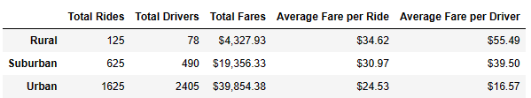
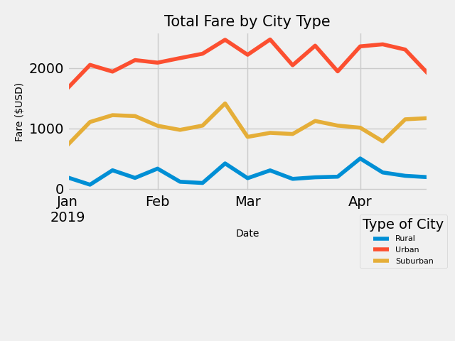

# PyBer_Analysis

>"It's your second week as a data analyst at PyBer, a ride-sharing app company valued at $2.3 billion. You've just been assigned your first big project: analyze all the rideshare data from January to early May of 2019 and create a compelling visualization for the CEO, V. Isualize."

________________________________________________________________________
## Overview of the analysis: 
### Explain the purpose of the new analysis.

>"V. Isualize has given you and Omar a brand-new assignment. Using your Python skills and knowledge of Pandas, you’ll create a summary DataFrame of the ride-sharing data by city type. Then, using Pandas and Matplotlib, you’ll create a multiple-line graph that shows the total weekly fares for each city type. Finally, you’ll submit a written report that summarizes how the data differs by city type and how those differences can be used by decision-makers at PyBer."

Our CEO has given my boss and I a new project to analyze ride-sharing data from January to early May of 2019 by city type.  It's important to remember that our CEO was a former programmer, so mistakes are unacceptable. 

Our project has two important subcomponents: 
1) The data visualization must be easy to read for the PyBer Executives. 
2) The data visualization must be self-explanatory. 

This analysis will be done using the Pandas library for data storage and basic data analysis.  The Matplotlib library will be used to create the requested data visualization.  This is an excellent opportunity to further our career in the data science field.  
 
## Results: 
### Using images from the summary DataFrame and multiple-line chart, describe the differences in ride-sharing data among the different city types.

Urban cities have the most drivers. Suburban cities have the second largest number of drivers, and rural cities have the least number of drivers. 

There seems to be some type of correlation between number of drivers, number of rides, and total fares.  The more drivers then the more rides that can be offered. 
This could also lead to more fares paid as well depending on some other factors.

Average fare per ride and driver seem to have some correlation to distance traveled.  Fares per driver and ride are more expensive for rural cities due to distance traveled is likely greater than other city types.   

None of the city types seem to have any pattern to their weekly ride-share fares.  Urban cities have the most amount of fares and rural cities have the least amount of fares.  Suburban cities have more fares than rural cities but less than urban cities. 
 

## Summary: 
### Based on the results, provide three business recommendations to the CEO for addressing any disparities among the city types

1) Rural cities have the least amount of drivers; as well as having the least amount of rides offered.  This would be more of an issue if the number of rides far exceeds the reasonable number of drives per person.  For continued growth in this market, it would be recommended to focus some marketing on this demographic, but maybe not a large portion of the budget. 
2) Rural cities also have higher rates per driver due to distance traveled is further then it would likely be in another city type.  In an urban community, a person may only need a rideshare for 5 miles. While a person in a rural city, could require a ride-share for 15 miles.  It would be recommended to focus on that the price for the ride-share is the same in different city types in marketing materials.  
3) Rural and Suburban ride-share count exceeds the number of drivers. It is critical to know that this data is for several months, and every driver can choose to drive that day or not.  One driver may choose to do 10 ride-shares or none.  Any help wanted ads should focus on the fact the driver's make their own schedule.

